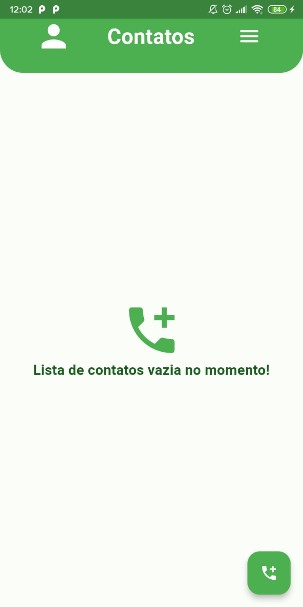
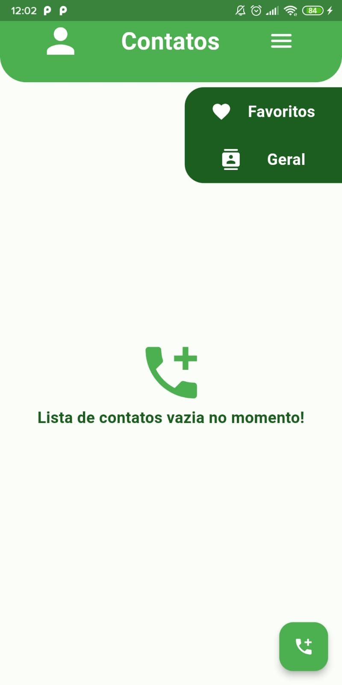
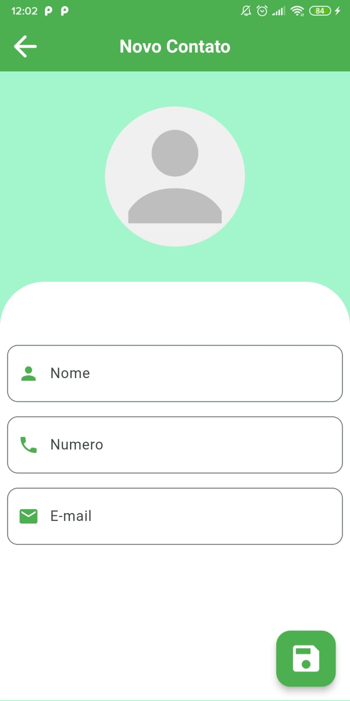
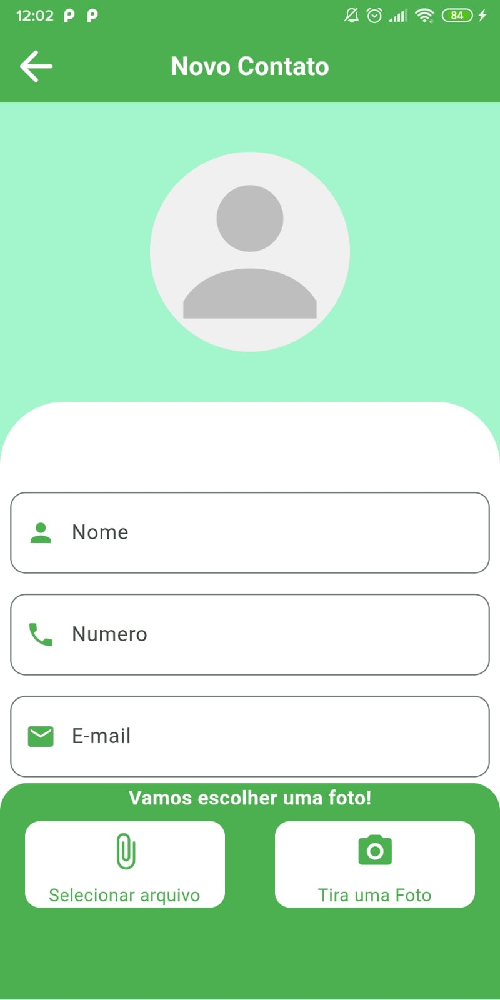
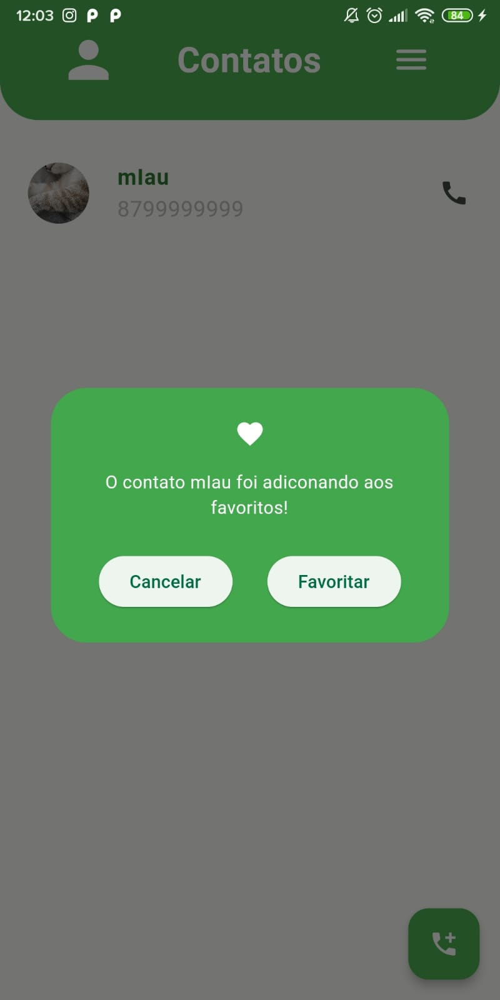
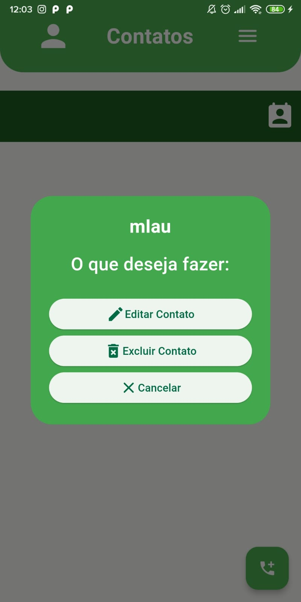
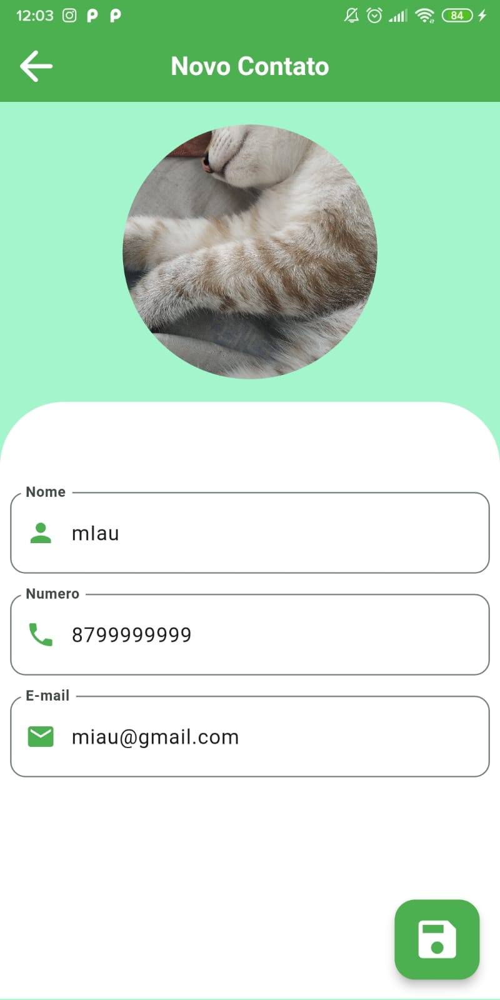

# **Contact List**
 

Lista de contatos totalmente em flutter, implementando conceitos basicos de **CRUD** e **GERENCIA DE ESTADO NATIVO** com **ValueNotifier** atribuindo também Persistência de dados local, projeto construído utilizando a arquitetura **MVC**.

## Principais Implementações:

- **Gerencia de Estado.**
- **[ MVC ] Arquitetura.**
- **Persistência de dados.**
- **CRUD.**

##   **Preview App** 

##   **Description of Tasks**

- Savar novos contatos:
    > Salva principais informações para um possível contato.
    
- Editar contatos já existentes.
    > Pode editar informações antes salvas.

- Deletar contatos.
    > Exclui contato salvo.

**Packages Ultilizados**

[shared_preferences](https://pub.dev/packages/shared_preferences)
 > Possibilidade de salvar dados localmente através de **chave e valor**.

[image_picker](https://pub.dev/packages/image_picker)
> Possibilita o acesso a câmera e galeria do celular, podendo utilizar dos arquivos dentro do app.

## **Teste App**
[Contact List APK](https://drive.google.com/file/d/1-Xmx6baYQZGi-upCfpcZV3pHAcxej1BS/view?usp=sharing)

[Projeto](https://github.com/JoseGoncalvess/Contact_List)

---
## Flutter Referencia

[ING-USA]

A few resources to get you started if this is your first Flutter project:

- [Lab: Write your first Flutter app](https://docs.flutter.dev/get-started/codelab)
- [Cookbook: Useful Flutter samples](https://docs.flutter.dev/cookbook)

For help getting started with Flutter development, view the
[online documentation](https://docs.flutter.dev/), which offers tutorials,
samples, guidance on mobile development, and a full API reference.

[PT-BR]

Alguns recursos para você começar se este for seu primeiro projeto Flutter:
- [Laboratório: Escreva seu primeiro aplicativo Flutter](https://docs.flutter.dev/get-started/codelab)
- [Cookbook: Useful Flutter samples](https://docs.flutter.dev/cookbook)

Para obter ajuda para começar com o desenvolvimento do Flutter, veja o [documentação on-line](https://docs.flutter.dev/),que oferece tutoriais,
amostras, orientação sobre desenvolvimento móvel e uma referência completa da API.